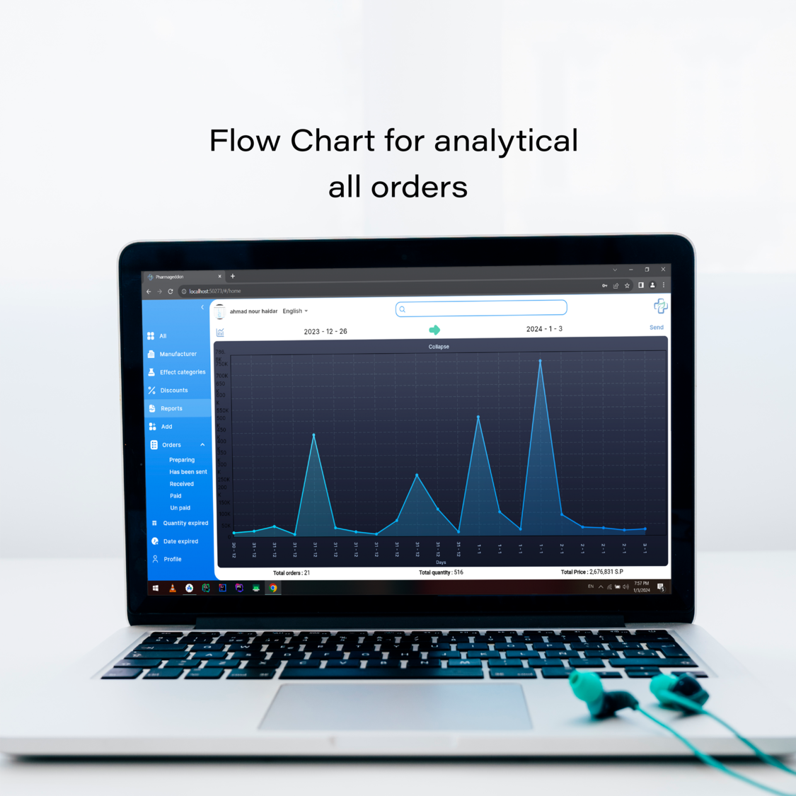

# Pharmageddon Web Application

Pharmageddon is a comprehensive Flutter web application for managing drug warehouses and a mobile
application for pharmacies. It features secure authentication, detailed medicine information, order
tracking, multi-language support, and Firebase notifications to enhance user experience.

## Table of Contents

- [✨ Features](#-features)
- [📱 App Preview](#-app-preview)
- [⚙️ Installation](#-installation)
- [🚀 Usage](#-usage)
- [🤝 Contributing](#-contributing)
- [👥 Team Members](#-team-members)
- [📄 License](#-license)

## ✨ Features

- **Secure Authentication**: Login and registration with secure authentication.
- **Medicine Browsing**: Browse and search for medications with detailed descriptions and
  manufacturer information and effect categories.
- **Order Management**: Add medications to your cart, adjust quantities, and place orders.
- **Order Tracking**: Track the status of your orders in real-time.
- **Multi Language Support**: Choose your preferred application language.
- **Firebase Notifications**: Receive real-time notifications about your orders and app updates.

## 📱 App Preview

<div style="display: flex; flex-wrap: wrap; gap: 50px;">




</div>

## ⚙️ Installation

1. **Clone the repository**:
    ```bash
    git clone https://github.com/Ahmad-Nour-Haidar/pharmageddon-web.git
    ```

2. **Navigate to the project directory**:
    ```bash
    cd pharmageddon-web
    ```

3. **Install dependencies**:
    ```bash
    flutter pub get
    ```

4. **Run the web application**:
    ```bash
    flutter run -d chrome
    ```

## 🚀 Usage

1. **Register or Login**: Open the app and either log in with your existing account or create a new
   one.
2. **Browse Medications**: Explore the list of available medications, read detailed descriptions,
   and check manufacturer information.
3. **Manage Cart**: Add desired medications to your cart, adjust quantities, and proceed to order.
4. **Track Orders**: Monitor the status of your orders in real-time and receive notifications about
   updates.
5. **View Analytics**: Analyze your order history and details.

## 🤝 Contributing

We welcome contributions to enhance the Pharmacie app. Here’s how you can help:

1. **Fork the repository**.
2. **Create a new branch**:
    ```bash
    git checkout -b feature-branch
    ```
3. **Make your changes and commit them**:
    ```bash
    git commit -m "Description of the feature"
    ```
4. **Push to the branch**:
    ```bash
    git push origin feature-branch
    ```
5. **Create a pull request**.

Please ensure your pull request adheres to the following guidelines:

- Describe the feature or fix in detail.
- Ensure the code follows the existing style and conventions.
- Include screenshots or demos of the new feature or fix if applicable.

## 👥 Team Members

| S.No. | Team Member Name  | GitHub                                                     | Technology      |
|-------|-------------------|------------------------------------------------------------|-----------------|
| 1.    | Ahmad Nour Haidar | [@Ahmad-Nour-Haidar](https://github.com/Ahmad-Nour-Haidar) | Flutter Mobile  |
| 2.    | Ayman Albonny     | [@Ayman2023bo](https://github.com/Ayman2023bo)             | Flutter Mobile  |
| 3.    | Osama Saddik      | [@osamasaddik](https://github.com/osamasaddik)             | Laravel Backend |

## 📄 License

This project is licensed under the MIT License. See the [LICENSE](LICENSE) file for details.
